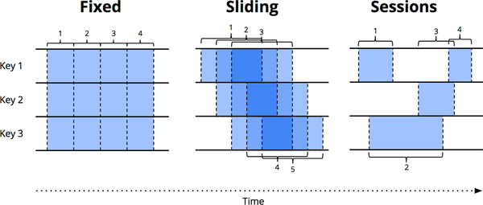

# Chapter 2. The What, Where, When, and How of Data Processing

Okay party people, it’s time to get concrete!

Chapter 1 focused on three main areas: terminology, defining precisely what I mean when I use overloaded terms like “streaming”; batch versus streaming, comparing the theoretical capabilities of the two types of systems, and postulating that only two things are necessary to take streaming systems beyond their batch counterparts: correctness and tools for reasoning about time; and data processing patterns, looking at the conceptual approaches taken with both batch and streaming systems when processing bounded and unbounded data.

In this chapter, we’re now going to focus further on the data processing patterns from Chapter 1, but in more detail, and within the context of concrete examples. By the time we’re finished, we’ll have covered what I consider to be the core set of principles and concepts required for robust out-of-order data processing; these are the tools for reasoning about time that truly get you beyond classic batch processing.

To give you a sense of what things look like in action, I use snippets of Apache Beam code, coupled with time-lapse diagrams1 to provide a visual representation of the concepts. Apache Beam is a unified programming model and portability layer for batch and stream processing, with a set of concrete SDKs in various languages (e.g., Java and Python). Pipelines written with Apache Beam can then be portably run on any of the supported execution engines (Apache Apex, Apache Flink, Apache Spark, Cloud Dataflow, etc.).

I use Apache Beam here for examples not because this is a Beam book (it’s not), but because it most completely embodies the concepts described in this book. Back when “Streaming 102” was originally written (back when it was still the Dataflow Model from Google Cloud Dataflow and not the Beam Model from Apache Beam), it was literally the only system in existence that provided the amount of expressiveness necessary for all the examples we’ll cover here. A year and a half later, I’m happy to say much has changed, and most of the major systems out there have moved or are moving toward supporting a model that looks a lot like the one described in this book. So rest assured that the concepts we cover here, though informed through the Beam lens, as it were, will apply equally across most other systems you’ll come across.

## Roadmap

To help set the stage for this chapter, I want to lay out the five main concepts that will underpin all of the discussions therein, and really, for most of the rest of Part I. We’ve already covered two of them.

In Chapter 1, I first established the critical distinction between event time (the time that events happen) and processing time (the time they are observed during processing). This provides the foundation for one of the main theses put forth in this book: if you care about both correctness and the context within which events actually occurred, you must analyze data relative to their inherent event times, not the processing time at which they are encountered during the analysis itself.

I then introduced the concept of windowing (i.e., partitioning a dataset along temporal boundaries), which is a common approach used to cope with the fact that unbounded data sources technically might never end. Some simpler examples of windowing strategies are fixed and sliding windows, but more sophisticated types of windowing, such as sessions (in which the windows are defined by features of the data themselves; for example, capturing a session of activity per user followed by a gap of inactivity) also see broad usage.

In addition to these two concepts, we’re now going to look closely at three more:

Triggers
A trigger is a mechanism for declaring when the output for a window should be materialized relative to some external signal. Triggers provide flexibility in choosing when outputs should be emitted. In some sense, you can think of them as a flow control mechanism for dictating when results should be materialized. Another way of looking at it is that triggers are like the shutter-release on a camera, allowing you to declare when to take a snapshots in time of the results being computed.

Triggers also make it possible to observe the output for a window multiple times as it evolves. This in turn opens up the door to refining results over time, which allows for providing speculative results as data arrive, as well as dealing with changes in upstream data (revisions) over time or data that arrive late (e.g., mobile scenarios, in which someone’s phone records various actions and their event times while the person is offline and then proceeds to upload those events for processing upon regaining connectivity).

Watermarks
A watermark is a notion of input completeness with respect to event times. A watermark with value of time X makes the statement: “all input data with event times less than X have been observed.” As such, watermarks act as a metric of progress when observing an unbounded data source with no known end. We touch upon the basics of watermarks in this chapter, and then Slava goes super deep on the subject in Chapter 3.

Accumulation
An accumulation mode specifies the relationship between multiple results that are observed for the same window. Those results might be completely disjointed; that is, representing independent deltas over time, or there might be overlap between them. Different accumulation modes have different semantics and costs associated with them and thus find applicability across a variety of use cases.

Also, because I think it makes it easier to understand the relationships between all of these concepts, we revisit the old and explore the new within the structure of answering four questions, all of which I propose are critical to every unbounded data processing problem:

What results are calculated? This question is answered by the types of transformations within the pipeline. This includes things like computing sums, building histograms, training machine learning models, and so on. It’s also essentially the question answered by classic batch processing

Where in event time are results calculated? This question is answered by the use of event-time windowing within the pipeline. This includes the common examples of windowing from Chapter 1 (fixed, sliding, and sessions); use cases that seem to have no notion of windowing (e.g., time-agnostic processing; classic batch processing also generally falls into this category); and other, more complex types of windowing, such as time-limited auctions. Also note that it can include processing-time windowing, as well, if you assign ingress times as event times for records as they arrive at the system.

When in processing time are results materialized? This question is answered by the use of triggers and (optionally) watermarks. There are infinite variations on this theme, but the most common patterns are those involving repeated updates (i.e., materialized view semantics), those that utilize a watermark to provide a single output per window only after the corresponding input is believed to be complete (i.e., classic batch processing semantics applied on a per-window basis), or some combination of the two.

How do refinements of results relate? This question is answered by the type of accumulation used: discarding (in which results are all independent and distinct), accumulating (in which later results build upon prior ones), or accumulating and retracting (in which both the accumulating value plus a retraction for the previously triggered value(s) are emitted).

We look at each of these questions in much more detail throughout the rest of the book. And, yes, I’m going to run this color scheme thing into the ground in an attempt to make it abundantly clear which concepts relate to which question in the What/Where/When/How idiom. You’re welcome <winky-smiley/>.2

## Batch Foundations: What and Where
Okay, let’s get this party started. First stop: batch processing.

What: Transformations
The transformations applied in classic batch processing answer the question: “What results are calculated?” Even though you are likely already familiar with classic batch processing, we’re going to start there anyway because it’s the foundation on top of which we add all of the other concepts.

In the rest of this chapter (and indeed, through much of the book), we look at a single example: computing keyed integer sums over a simple dataset consisting of nine values. Let’s imagine that we’ve written a team-based mobile game and we want to build a pipeline that calculates team scores by summing up the individual scores reported by users’ phones. If we were to capture our nine example scores in a SQL table named “UserScores,” it might look something like this:
```sql
SELECT * FROM UserScores ORDER BY EventTime;
```

| Name  | Team  | Score | EventTime | ProcTime |
| ---- | ---- | ---- | ---- | ---- |
| Julie | TeamX |     5 |  12:00:26 | 12:05:19 |
| Frank | TeamX |     9 |  12:01:26 | 12:08:19 |
| Ed    | TeamX |     7 |  12:02:26 | 12:05:39 |
| Julie | TeamX |     8 |  12:03:06 | 12:07:06 |
| Amy   | TeamX |     3 |  12:03:39 | 12:06:13 |
| Fred  | TeamX |     4 |  12:04:19 | 12:06:39 |
| Naomi | TeamX |     3 |  12:06:39 | 12:07:19 |
| Becky | TeamX |     8 |  12:07:26 | 12:08:39 |
| Naomi | TeamX |     1 |  12:07:46 | 12:09:00 |

Note that all the scores in this example are from users on the same team; this is to keep the example simple, given that we have a limited number of dimensions in our diagrams that follow. And because we’re grouping by team, we really just care about the last three columns:

Score
The individual user score associated with this event

EventTime
The event time for the score; that is, the time at which the score occurred

ProcTime
The processing for the score; that is, the time at which the score was observed by the pipeline

For each example pipeline, we’ll look at a time-lapse diagram that highlights how the data evolves over time. Those diagrams plot our nine scores in the two dimensions of time we care about: event time in the x-axis, and processing time in the y-axis. Figure 2-1 illustrates what a static plot of the input data looks like.


Figure 2-1. Nine input records, plotted in both event time and processing time
Subsequent time-lapse diagrams are either animations (Safari) or a sequence of frames (print and all other digital formats), allowing you to see how the data are processed over time (more on this shortly after we get to the first time-lapse diagram).

Preceding each example is a short snippet of Apache Beam Java SDK pseudocode to make the definition of the pipeline more concrete. It is pseudocode in the sense that I sometime bend the rules to make the examples clearer, elide details (like the use of concrete I/O sources), or simplify names (the trigger names in Beam Java 2.x and earlier are painfully verbose; I use simpler names for clarity). Beyond minor things like those, it’s otherwise real-world Beam code (and real code is available on GitHub for all examples in this chapter).

If you’re already familiar with something like Spark or Flink, you should have a relatively easy time understanding what the Beam code is doing. But to give you a crash course in things, there are two basic primitives in Beam:

PCollections
These represent datasets (possibly massive ones) across which parallel transformations can be performed (hence the “P” at the beginning of the name).

PTransforms
These are applied to PCollections to create new PCollections. PTransforms may perform element-wise transformations, they may group/aggregate multiple elements together, or they may be a composite combination of other PTransforms, as depicted in Figure 2-2.


Figure 2-2. Types of transformations
For the purposes of our examples, we typically assume that we start out with a pre-loaded PCollection<KV<Team, Integer>> named “input” (that is, a PCollection composed of key/value pairs of Teams and Integers, where the Teams are just something like Strings representing team names, and the Integers are scores from any individual on the corresponding team). In a real-world pipeline, we would’ve acquired input by reading in a PCollection<String> of raw data (e.g., log records) from an I/O source and then transforming it into a PCollection<KV<Team, Integer>> by parsing the log records into appropriate key/value pairs. For the sake of clarity in this first example, I include pseudocode for all of those steps, but in subsequent examples, I elide the I/O and parsing.

Thus, for a pipeline that simply reads in data from an I/O source, parses team/score pairs, and calculates per-team sums of scores, we’d have something like that shown in Example 2-1.

Example 2-1. Summation pipeline

```java
PCollection<String> raw = IO.read(...);
PCollection<KV<Team, Integer>> input = raw.apply(new ParseFn());
PCollection<KV<Team, Integer>> totals =
  input.apply(Sum.integersPerKey());
```

Key/value data are read from an I/O source, with a Team (e.g., String of the team name) as the key and an Integer (e.g., individual team member scores) as the value. The values for each key are then summed together to generate per-key sums (e.g., total team score) in the output collection.

For all the examples to come, after seeing a code snippet describing the pipeline that we’re analyzing, we’ll then look at a time-lapse diagram showing the execution of that pipeline over our concrete dataset for a single key. In a real pipeline, you can imagine that similar operations would be happening in parallel across multiple machines, but for the sake of our examples, it will be clearer to keep things simple.

As noted previously, Safari editions present the complete execution as an animated movie, whereas print and all other digital formats use a static sequence of key frames that provide a sense of how the pipeline progresses over time. In both cases, we also provide a URL to a fully animated version on www.streamingbook.net.

Each diagram plots the inputs and outputs across two dimensions: event time (on the x-axis) and processing time (on the y-axis). Thus, real time as observed by the pipeline progresses from bottom to top, as indicated by the thick horizontal black line that ascends in the processing-time axis as time progresses. Inputs are circles, with the number inside the circle representing the value of that specific record. They start out light gray, and darken as the pipeline observes them.

As the pipeline observes values, it accumulates them in its intermediate state and eventually materializes the aggregate results as output. State and output are represented by rectangles (gray for state, blue for output), with the aggregate value near the top, and with the area covered by the rectangle representing the portions of event time and processing time accumulated into the result. For the pipeline in Example 2-1, it would look something like that shown in Figure 2-3 when executed on a classic batch engine.


Figure 2-3. Classic batch processing
Because this is a batch pipeline, it accumulates state until it’s seen all of the inputs (represented by the dashed green line at the top), at which point it produces its single output of 48. In this example, we’re calculating a sum over all of event time because we haven’t applied any specific windowing transformations; hence the rectangles for state and output cover the entirety of the x-axis. If we want to process an unbounded data source, however, classic batch processing won’t be sufficient; we can’t wait for the input to end, because it effectively never will. One of the concepts we want is windowing, which we introduced in Chapter 1. Thus, within the context of our second question—“Where in event time are results calculated?”—we’ll now briefly revisit windowing.

Where: Windowing
As discussed in Chapter 1, windowing is the process of slicing up a data source along temporal boundaries. Common windowing strategies include fixed windows, sliding windows, and sessions windows, as demonstrated in Figure 2-4.



Figure 2-4. Example windowing strategies. Each example is shown for three different keys, highlighting the difference between aligned windows (which apply across all the data) and unaligned windows (which apply across a subset of the data).
To get a better sense of what windowing looks like in practice, let’s take our integer summation pipeline and window it into fixed, two-minute windows. With Beam, the change is a simple addition of a Window.into transform, which you can see highlighted in Example 2-2.

Example 2-2. Windowed summation code

```java
PCollection<KV<Team, Integer>> totals = input
  .apply(Window.into(FixedWindows.of(TWO_MINUTES)))
  .apply(Sum.integersPerKey());
```


Recall that Beam provides a unified model that works in both batch and streaming because semantically batch is really just a subset of streaming. As such, let’s first execute this pipeline on a batch engine; the mechanics are more straightforward, and it will give us something to directly compare against when we switch to a streaming engine. Figure 2-5 presents the result.


Figure 2-5. Windowed summation on a batch engine
As before, inputs are accumulated in state until they are entirely consumed, after which output is produced. In this case, however, instead of one output, we get four: a single output, for each of the four relevant two-minute event-time windows.

At this point we’ve revisited the two main concepts that I introduced in Chapter 1: the relationship between the event-time and processing-time domains, and windowing. If we want to go any further, we’ll need to start adding the new concepts mentioned at the beginning of this section: triggers, watermarks, and accumulation.

## Going Streaming: When and How
We just observed the execution of a windowed pipeline on a batch engine. But, ideally, we’d like to have lower latency for our results, and we’d also like to natively handle unbounded data sources. Switching to a streaming engine is a step in the right direction, but our previous strategy of waiting until our input has been consumed in its entirety to generate output is no longer feasible. Enter triggers and watermarks.

When: The Wonderful Thing About Triggers Is Triggers Are Wonderful Things!
Triggers provide the answer to the question: “When in processing time are results materialized?” Triggers declare when output for a window should happen in processing time (though the triggers themselves might make those decisions based on things that happen in other time domains, such as watermarks progressing in the event-time domain, as we’ll see in a few moments). Each specific output for a window is referred to as a pane of the window.

Though it’s possible to imagine quite a breadth of possible triggering semantics,3 conceptually there are only two generally useful types of triggers, and practical applications almost always boil down using either one or a combination of both:

Repeated update triggers
These periodically generate updated panes for a window as its contents evolve. These updates can be materialized with every new record, or they can happen after some processing-time delay, such as once a minute. The choice of period for a repeated update trigger is primarily an exercise in balancing latency and cost.

Completeness triggers
These materialize a pane for a window only after the input for that window is believed to be complete to some threshold. This type of trigger is most analogous to what we’re familiar with in batch processing: only after the input is complete do we provide a result. The difference in the trigger-based approach is that the notion of completeness is scoped to the context of a single window, rather than always being bound to the completeness of the entire input.

Repeated update triggers are the most common type of trigger encountered in streaming systems. They are simple to implement and simple to understand, and they provide useful semantics for a specific type of use case: repeated (and eventually consistent) updates to a materialized dataset, analogous to the semantics you get with materialized views in the database world.

Completeness triggers are less frequently encountered, but provide streaming semantics that more closely align with those from the classic batch processing world. They also provide tools for reasoning about things like missing data and late data, both of which we discuss shortly (and in the next chapter) as we explore the underlying primitive that drives completeness triggers: watermarks.

But first, let’s start simple and look at some basic repeated update triggers in action. To make the notion of triggers a bit more concrete, let’s go ahead and add the most straightforward type of trigger to our example pipeline: a trigger that fires with every new record, as shown in Example 2-3.

>  Example 2-3. Triggering repeatedly with every record
>
>```java
>PCollection<KV<Team, Integer>> totals = input
>  .apply(Window.into(FixedWindows.of(TWO_MINUTES))
>                .triggering(Repeatedly(AfterCount(1))));
>  .apply(Sum.integersPerKey());
>```

If we were to run this new pipeline on a streaming engine, the results would look something like that shown in Figure 2-6.


Figure 2-6. Per-record triggering on a streaming engine
You can see how we now get multiple outputs (panes) for each window: once per corresponding input. This sort of triggering pattern works well when the output stream is being written to some sort of table that you can simply poll for results. Any time you look in the table, you’ll see the most up-to-date value for a given window, and those values will converge toward correctness over time.

One downside of per-record triggering is that it’s quite chatty. When processing large-scale data, aggregations like summation provide a nice opportunity to reduce the cardinality of the stream without losing information. This is particularly noticeable for cases in which you have high-volume keys; for our example, massive teams with lots of active players. Imagine a massively multiplayer game in which players are split into one of two factions, and you want to tally stats on a per-faction basis. It’s probably unnecessary to update your tallies with every new input record for every player in a given faction. Instead, you might be happy updating them after some processing-time delay, say every second, or every minute. The nice side effect of using processing-time delays is that it has an equalizing effect across high-volume keys or windows: the resulting stream ends up being more uniform cardinality-wise.

There are two different approaches to processing-time delays in triggers: aligned delays (where the delay slices up processing time into fixed regions that align across keys and windows) and unaligned delays (where the delay is relative to the data observed within a given window). A pipeline with unaligned delays might look like Example 2-4, the results of which are shown in Figure 2-7.

> Example 2-4. Triggering on aligned two-minute processing-time boundaries
>
> ```java
> PCollection<KV<Team, Integer>> totals = input
>   .apply(Window.into(FixedWindows.of(TWO_MINUTES))
>                .triggering(Repeatedly(AlignedDelay(TWO_MINUTES)))
>   .apply(Sum.integersPerKey());
> ```
>
> 


Figure 2-7. Two-minute aligned delay triggers (i.e., microbatching)
This sort of aligned delay trigger is effectively what you get from a microbatch streaming system like Spark Streaming. The nice thing about it is predictability; you get regular updates across all modified windows at the same time. That’s also the downside: all updates happen at once, which results in bursty workloads that often require greater peak provisioning to properly handle the load. The alternative is to use an unaligned delay. That would look something Example 2-5 in Beam. Figure 2-8 presents the results.

Example 2-5. Triggering on unaligned two-minute processing-time boundaries
PCollection<KV<Team, Integer>> totals = input
  .apply(Window.into(FixedWindows.of(TWO_MINUTES))
               .triggering(Repeatedly(UnalignedDelay(TWO_MINUTES))
  .apply(Sum.integersPerKey());


Figure 2-8. Two-minute unaligned delay triggers
Contrasting the unaligned delays in Figure 2-8 to the aligned delays in Figure 2-6, it’s easy to see how the unaligned delays spread the load out more evenly across time. The actual latencies involved for any given window differ between the two, sometimes more and sometimes less, but in the end the average latency will remain essentially the same. From that perspective, unaligned delays are typically the better choice for large-scale processing because they result in a more even load distribution over time.

Repeated update triggers are great for use cases in which we simply want periodic updates to our results over time and are fine with those updates converging toward correctness with no clear indication of when correctness is achieved. However, as we discussed in Chapter 1, the vagaries of distributed systems often lead to a varying level of skew between the time an event happens and the time it’s actually observed by your pipeline, which means it can be difficult to reason about when your output presents an accurate and complete view of your input data. For cases in which input completeness matters, it’s important to have some way of reasoning about completeness rather than blindly trusting the results calculated by whichever subset of data happen to have found their way to your pipeline. Enter watermarks.

When: Watermarks
Watermarks are a supporting aspect of the answer to the question: “When in processing time are results materialized?” Watermarks are temporal notions of input completeness in the event-time domain. Worded differently, they are the way the system measures progress and completeness relative to the event times of the records being processed in a stream of events (either bounded or unbounded, though their usefulness is more apparent in the unbounded case).

Recall this diagram from Chapter 1, slightly modified in Figure 2-9, in which I described the skew between event time and processing time as an ever-changing function of time for most real-world distributed data processing systems.


Figure 2-9. Event-time progress, skew, and watermarks
That meandering red line that I claimed represented reality is essentially the watermark; it captures the progress of event-time completeness as processing time progresses. Conceptually, you can think of the watermark as a function, F(P) → E, which takes a point in processing time and returns a point in event time.4 That point in event time, E, is the point up to which the system believes all inputs with event times less than E have been observed. In other words, it’s an assertion that no more data with event times less than E will ever be seen again. Depending upon the type of watermark, perfect or heuristic, that assertion can be a strict guarantee or an educated guess, respectively:

Perfect watermarks
For the case in which we have perfect knowledge of all of the input data, it’s possible to construct a perfect watermark. In such a case, there is no such thing as late data; all data are early or on time.

Heuristic watermarks
For many distributed input sources, perfect knowledge of the input data is impractical, in which case the next best option is to provide a heuristic watermark. Heuristic watermarks use whatever information is available about the inputs (partitions, ordering within partitions if any, growth rates of files, etc.) to provide an estimate of progress that is as accurate as possible. In many cases, such watermarks can be remarkably accurate in their predictions. Even so, the use of a heuristic watermark means that it might sometimes be wrong, which will lead to late data. We show you about ways to deal with late data soon.

Because they provide a notion of completeness relative to our inputs, watermarks form the foundation for the second type of trigger mentioned previously: completeness triggers. Watermarks themselves are a fascinating and complex topic, as you’ll see when you get to Slava’s watermarks deep dive in Chapter 3. But for now, let’s look at them in action by updating our example pipeline to utilize a completeness trigger built upon watermarks, as demonstrated in Example 2-6.

Example 2-6. Watermark completeness trigger
PCollection<KV<Team, Integer>> totals = input
  .apply(Window.into(FixedWindows.of(TWO_MINUTES))
               .triggering(AfterWatermark()))
  .apply(Sum.integersPerKey());
Now, an interesting quality of watermarks is that they are a class of functions, meaning there are multiple different functions F(P) → E that satisfy the properties of a watermark, to varying degrees of success. As I noted earlier, for situations in which you have perfect knowledge of your input data, it might be possible to build a perfect watermark, which is the ideal situation. But for cases in which you lack perfect knowledge of the inputs or for which it’s simply too computationally expensive to calculate the perfect watermark, you might instead choose to utilize a heuristic for defining your watermark. The point I want to make here is that the given watermark algorithm in use is independent from the pipeline itself. We’re not going to discuss in detail what it means to implement a watermark here (Slava does that in Chapter 3). For now, to help drive home this idea that a given input set can have different watermarks applied to it, let’s take a look at our pipeline in Example 2-6 when executed on the same dataset but using two distinct watermark implementations (Figure 2-10): on the left, a perfect watermark; on the right, a heuristic watermark.

In both cases, windows are materialized as the watermark passes the end of the window. The perfect watermark, as you might expect, perfectly captures the event-time completeness of the pipeline as time progresses. In contrast, the specific algorithm used for the heuristic watermark on the right fails to take the value of 9 into account,5 which drastically changes the shape of the materialized outputs, both in terms of output latency and correctness (as seen by the incorrect answer of 5 that’s provided for the [12:00, 12:02) window).

The big difference between the watermark triggers from Figure 2-9 and the repeated update triggers we saw in Figures 2-5 through 2-7 is that the watermarks give us a way to reason about the completeness of our input. Until the system materializes an output for a given window, we know that the system does not yet believe the inputs to be complete. This is especially important for use cases in which you want to reason about a lack of data in the input, or missing data.


Figure 2-10. Windowed summation on a streaming engine with perfect (left) and heuristic (right) watermarks
A great example of a missing-data use case is outer joins. Without a notion of completeness like watermarks, how do you know when to give up and emit a partial join rather than continue to wait for that join to complete? You don’t. And basing that decision on a processing-time delay, which is the common approach in streaming systems that lack true watermark support, is not a safe way to go, because of the variable nature of event-time skew we spoke about in Chapter 1: as long as skew remains smaller than the chosen processing-time delay, your missing-data results will be correct, but any time skew grows beyond that delay, they will suddenly become incorrect. From this perspective, event-time watermarks are a critical piece of the puzzle for many real-world streaming use cases which must reason about a lack of data in the input, such as outer joins, anomaly detection, and so on.

Now, with that said, these watermark examples also highlight two shortcomings of watermarks (and any other notion of completeness), specifically that they can be one of the following:

Too slow
When a watermark of any type is correctly delayed due to known unprocessed data (e.g., slowly growing input logs due to network bandwidth constraints), that translates directly into delays in output if advancement of the watermark is the only thing you depend on for stimulating results.

This is most obvious in the left diagram of Figure 2-10, for which the late arriving 9 holds back the watermark for all the subsequent windows, even though the input data for those windows become complete earlier. This is particularly apparent for the second window, [12:02, 12:04), for which it takes nearly seven minutes from the time the first value in the window occurs until we see any results for the window whatsoever. The heuristic watermark in this example doesn’t suffer the same issue quite so badly (five minutes until output), but don’t take that to mean heuristic watermarks never suffer from watermark lag; that’s really just a consequence of the record I chose to omit from the heuristic watermark in this specific example.

The important point here is the following: Although watermarks provide a very useful notion of completeness, depending upon completeness for producing output is often not ideal from a latency perspective. Imagine a dashboard that contains valuable metrics, windowed by hour or day. It’s unlikely you’d want to wait a full hour or day to begin seeing results for the current window; that’s one of the pain points of using classic batch systems to power such systems. Instead, it would be much nicer to see the results for those windows refine over time as the inputs evolve and eventually become complete.

Too fast
When a heuristic watermark is incorrectly advanced earlier than it should be, it’s possible for data with event times before the watermark to arrive some time later, creating late data. This is what happened in the example on the right: the watermark advanced past the end of the first window before all the input data for that window had been observed, resulting in an incorrect output value of 5 instead of 14. This shortcoming is strictly a problem with heuristic watermarks; their heuristic nature implies they will sometimes be wrong. As a result, relying on them alone for determining when to materialize output is insufficient if you care about correctness.

In Chapter 1, I made some rather emphatic statements about notions of completeness being insufficient for most use cases requiring robust out-of-order processing of unbounded data streams. These two shortcomings—watermarks being too slow or too fast—are the foundations for those arguments. You simply cannot get both low latency and correctness out of a system that relies solely on notions of completeness.6 So, for cases for which you do want the best of both worlds, what’s a person to do? Well, if repeated update triggers provide low-latency updates but no way to reason about completeness, and watermarks provide a notion of completeness but variable and possible high latency, why not combine their powers together?

When: Early/On-Time/Late Triggers FTW!
We’ve now looked at the two main types of triggers: repeated update triggers and completeness/watermark triggers. In many case, neither of them alone is sufficient, but the combination of them together is. Beam recognizes this fact by providing an extension of the standard watermark trigger that also supports repeated update triggering on either side of the watermark. This is known as the early/on-time/late trigger because it partitions the panes that are materialized by the compound trigger into three categories:

Zero or more early panes, which are the result of a repeated update trigger that periodically fires up until the watermark passes the end of the window. The panes generated by these firings contain speculative results, but allow us to observe the evolution of the window over time as new input data arrive. This compensates for the shortcoming of watermarks sometimes being too slow.

A single on-time pane, which is the result of the completeness/watermark trigger firing after the watermark passes the end of the window. This firing is special because it provides an assertion that the system now believes the input for this window to be complete.7 This means that it is now safe to reason about missing data; for example, to emit a partial join when performing an outer join.

Zero or more late panes, which are the result of another (possibly different) repeated update trigger that periodically fires any time late data arrive after the watermark has passed the end of the window. In the case of a perfect watermark, there will always be zero late panes. But in the case of a heuristic watermark, any data the watermark failed to properly account for will result in a late firing. This compensates for the shortcoming of watermarks being too fast.

Let’s see how this looks in action. We’ll update our pipeline to use a periodic processing-time trigger with an aligned delay of one minute for the early firings, and a per-record trigger for the late firings. That way, the early firings will give us some amount of batching for high-volume windows (thanks to the fact that the trigger will fire only once per minute, regardless of the throughput into the window), but we won’t introduce unnecessary latency for the late firings, which are hopefully somewhat rare if we’re using a reasonably accurate heuristic watermark. In Beam, that looks Example 2-7 (Figure 2-11 shows the results).

Example 2-7. Early, on-time, and late firings via the early/on-time/late API
PCollection<KV<Team, Integer>> totals = input
  .apply(Window.into(FixedWindows.of(TWO_MINUTES))
               .triggering(AfterWatermark()
			     .withEarlyFirings(AlignedDelay(ONE_MINUTE))
			     .withLateFirings(AfterCount(1))))
  .apply(Sum.integersPerKey());


Figure 2-11. Windowed summation on a streaming engine with early, on-time, and late firings
This version has two clear improvements over Figure 2-9:

For the “watermarks too slow” case in the second window, [12:02, 12:04): we now provide periodic early updates once per minute. The difference is most stark in the perfect watermark case, for which time-to-first-output is reduced from almost seven minutes down to three and a half; but it’s also clearly improved in the heuristic case, as well. Both versions now provide steady refinements over time (panes with values 7, 10, then 18), with relatively minimal latency between the input becoming complete and materialization of the final output pane for the window.

For the “heuristic watermarks too fast” case in the first window, [12:00, 12:02): when the value of 9 shows up late, we immediately incorporate it into a new, corrected pane with value of 14.

One interesting side effect of these new triggers is that they effectively normalize the output pattern between the perfect and heuristic watermark versions. Whereas the two versions in Figure 2-10 were starkly different, the two versions here look quite similar. They also look much more similar to the various repeated update version from Figures 2-6 through 2-8, with one important difference: thanks to the use of the watermark trigger, we can also reason about input completeness in the results we generate with the early/on-time/late trigger. This allows us to better handle use cases that care about missing data, like outer joins, anomaly detection, and so on.

The biggest remaining difference between the perfect and heuristic early/on-time/late versions at this point is window lifetime bounds. In the perfect watermark case, we know we’ll never see any more data for a window after the watermark has passed the end of it, hence we can drop all of our state for the window at that time. In the heuristic watermark case, we still need to hold on to the state for a window for some amount of time to account for late data. But as of yet, our system doesn’t have any good way of knowing just how long state needs to be kept around for each window. That’s where allowed lateness comes in.

When: Allowed Lateness (i.e., Garbage Collection)
Before moving on to our last question (“How do refinements of results relate?”), I’d like to touch on a practical necessity within long-lived, out-of-order stream processing systems: garbage collection. In the heuristic watermarks example in Figure 2-11, the persistent state for each window lingers around for the entire lifetime of the example; this is necessary to allow us to appropriately deal with late data when/if they arrive. But while it would be great to be able to keep around all of our persistent state until the end of time, in reality, when dealing with an unbounded data source, it’s often not practical to keep state (including metadata) for a given window indefinitely; we’ll eventually run out of disk space (or at the very least tire of paying for it, as the value for older data diminishes over time).

As a result, any real-world out-of-order processing system needs to provide some way to bound the lifetimes of the windows it’s processing. A clean and concise way of doing this is by defining a horizon on the allowed lateness within the system; that is, placing a bound on how late any given record may be (relative to the watermark) for the system to bother processing it; any data that arrives after this horizon are simply dropped. After you’ve bounded how late individual data may be, you’ve also established precisely how long the state for windows must be kept around: until the watermark exceeds the lateness horizon for the end of the window. But in addition, you’ve also given the system the liberty to immediately drop any data later than the horizon as soon as they’re observed, which means the system doesn’t waste resources processing data that no one cares about.

MEASURING LATENESS
It might seem a little odd to be specifying a horizon for handling late data using the very metric that resulted in the late data in the first place (i.e., the heuristic watermark). And in some sense it is. But of the options available, it’s arguably the best. The only other practical option would be to specify the horizon in processing time (e.g., keep windows around for 10 minutes of processing time after the watermark passes the end of the window), but using processing time would leave the garbage collection policy vulnerable to issues within the pipeline itself (e.g., workers crashing, causing the pipeline to stall for a few minutes), which could lead to windows that didn’t actually have a chance to handle late data that they otherwise should have. By specifying the horizon in the event-time domain, garbage collection is directly tied to the actual progress of the pipeline, which decreases the likelihood that a window will miss its opportunity to handle late data appropriately.

Note however, that not all watermarks are created equal. When we speak of watermarks in this book, we generally refer to low watermarks, which pessimistically attempt to capture the event time of the oldest unprocessed record the system is aware of. The nice thing about dealing with lateness via low watermarks is that they are resilient to changes in event-time skew; no matter how large the skew in a pipeline may grow, the low watermark will always track the oldest outstanding event known to the system, providing the best guarantee of correctness possible.

In contrast, some systems may use the term “watermark” to mean other things. For example, watermarks in Spark Structured Streaming are high watermarks, which optimistically track the event time of the newest record the system is aware of. When dealing with lateness, the system is free to garbage collect any window older than the high watermark adjusted by some user-specified lateness threshold. In other words, the system allows you to specify the maximum amount of event-time skew you expect to see in your pipeline, and then throws away any data outside of that skew window. This can work well if skew within your pipeline remains within some constant delta, but is more prone to incorrectly discarding data than low watermarking schemes.

Because the interaction between allowed lateness and the watermark is a little subtle, it’s worth looking at an example. Let’s take the heuristic watermark pipeline from Example 2-7/Figure 2-11 and add in Example 2-8 a lateness horizon of one minute (note that this particular horizon has been chosen strictly because it fits nicely into the diagram; for real-world use cases, a larger horizon would likely be much more practical):

> Example 2-8. Early/on-time/late firings with allowed lateness
>
> ```java
> PCollection<KV<Team, Integer>> totals = input
>   .apply(Window.into(FixedWindows.of(TWO_MINUTES))
>                .triggering(
>                  AfterWatermark()
>                    .withEarlyFirings(AlignedDelay(ONE_MINUTE))
>                    .withLateFirings(AfterCount(1)))
>                .withAllowedLateness(ONE_MINUTE))
>  .apply(Sum.integersPerKey());
> ```

The execution of this pipeline would look something like Figure 2-12, in which I’ve added the following features to highlight the effects of allowed lateness:

The thick black line denoting the current position in processing time is now annotated with ticks indicating the lateness horizon (in event time) for all active windows.

When the watermark passes the lateness horizon for a window, that window is closed, which means that all state for the window is discarded. I leave around a dotted rectangle showing the extent of time (in both domains) that the window covered when it was closed, with a little tail extending to the right to denote the lateness horizon for the window (for contrasting against the watermark).

For this diagram only, I’ve added an additional late datum for the first window with value 6. The 6 is late, but still within the allowed lateness horizon and thus is incorporated into an updated result with value 11. The 9, however, arrives beyond the lateness horizon, so it is simply dropped.


Figure 2-12. Allowed lateness with early/on-time/late firings
Two final side notes about lateness horizons:

To be absolutely clear, if you happen to be consuming data from sources for which perfect watermarks are available, there’s no need to deal with late data, and an allowed lateness horizon of zero seconds will be optimal. This is what we saw in the perfect watermark portion of Figure 2-10.

One noteworthy exception to the rule of needing to specify lateness horizons, even when heuristic watermarks are in use, would be something like computing global aggregates over all time for a tractably finite number of keys (e.g., computing the total number of visits to your site over all time, grouped by web browser family). In this case, the number of active windows in the system is bounded by the limited keyspace in use. As long as the number of keys remains manageably low, there’s no need to worry about limiting the lifetime of windows via allowed lateness.

Practicality sated, let’s move on to our fourth and final question.

How: Accumulation
When triggers are used to produce multiple panes for a single window over time, we find ourselves confronted with the last question: “How do refinements of results relate?” In the examples we’ve seen so far, each successive pane is built upon the one immediately preceding it. However, there are actually three8 different modes of accumulation:9

Discarding
Every time a pane is materialized, any stored state is discarded. This means that each successive pane is independent from any that came before. Discarding mode is useful when the downstream consumer is performing some sort of accumulation itself; for example, when sending integers into a system that expects to receive deltas that it will sum together to produce a final count.

Accumulating
As in Figures 2-6 through 2-11, every time a pane is materialized, any stored state is retained, and future inputs are accumulated into the existing state. This means that each successive pane builds upon the previous panes. Accumulating mode is useful when later results can simply overwrite previous results, such as when storing output in a key/value store like HBase or Bigtable.

Accumulating and retracting
This is like accumulating mode, but when producing a new pane, it also produces independent retractions for the previous pane(s). Retractions (combined with the new accumulated result) are essentially an explicit way of saying “I previously told you the result was X, but I was wrong. Get rid of the X I told you last time, and replace it with Y.” There are two cases for which retractions are particularly helpful:

When consumers downstream are regrouping data by a different dimension, it’s entirely possible the new value may end up keyed differently from the previous value and thus end up in a different group. In that case, the new value can’t just overwrite the old value; you instead need the retraction to remove the old value

When dynamic windows (e.g., sessions, which we look at more closely in a few moments) are in use, the new value might be replacing more than one previous window, due to window merging. In this case, it can be difficult to determine from the new window alone which old windows are being replaced. Having explicit retractions for the old windows makes the task straightforward. We see an example of this in detail in Chapter 8.

The different semantics for each group are somewhat clearer when seen side-by-side. Consider the two panes for the second window (the one with event-time range [12:06, 12:08)) in Figure 2-11 (the one with early/on-time/late triggers). Table 2-1 shows what the values for each pane would look like across the three accumulation modes (with accumulating mode being the specific mode used in Figure 2-11 itself).

Table 2-1. Comparing accumulation modes using the second window from Figure 2-11
 	
Discarding

Accumulating

Accumulating & Retracting

Pane 1: inputs=[3]

3

3

3

Pane 2: inputs=[8, 1]

9

12

12, –3

Value of final normal pane

9

12

12

Sum of all panes

12

15

12

Let’s take a closer look at what’s happening:

Discarding
Each pane incorporates only the values that arrived during that specific pane. As such, the final value observed does not fully capture the total sum. However, if you were to sum all of the independent panes themselves, you would arrive at a correct answer of 12. This is why discarding mode is useful when the downstream consumer itself is performing some sort of aggregation on the materialized panes.

Accumulating
As in Figure 2-11, each pane incorporates the values that arrived during that specific pane, plus all of the values from previous panes. As such, the final value observed correctly captures the total sum of 12. If you were to sum up the individual panes themselves, however, you’d effectively be double-counting the inputs from pane 1, giving you an incorrect total sum of 15. This is why accumulating mode is most useful when you can simply overwrite previous values with new values: the new value already incorporates all of the data seen thus far.

Accumulating and retracting
Each pane includes both a new accumulating mode value as well as a retraction of the previous pane’s value. As such, both the last value observed (excluding retractions) as well as the total sum of all materialized panes (including retractions) provide you with the correct answer of 12. This is why retractions are so powerful.

Example 2-9 demonstrates discarding mode in action, illustrating the changes we would make to Example 2-7:

Example 2-9. Discarding mode version of early/on-time/late firings
PCollection<KV<Team, Integer>> totals = input
  .apply(Window.into(FixedWindows.of(TWO_MINUTES))
               .triggering(
                 AfterWatermark()
                   .withEarlyFirings(AlignedDelay(ONE_MINUTE))
                   .withLateFirings(AtCount(1)))
               .discardingFiredPanes())
  .apply(Sum.integersPerKey());
Running again on a streaming engine with a heuristic watermark would produce output like that shown in Figure 2-13.


Figure 2-13. Discarding mode version of early/on-time/late firings on a streaming engine
Even though the overall shape of the output is similar to the accumulating mode version from Figure 2-11, note how none of the panes in this discarding version overlap. As a result, each output is independent from the others.

If we want to look at retractions in action, the change would be similar, as shown in Example 2-10. ??? depicts the results.

Example 2-10. Accumulating and retracting mode version of early/on-time/late firings
PCollection<KV<Team, Integer>> totals = input
  .apply(Window.into(FixedWindows.of(TWO_MINUTES))
               .triggering(
                 AfterWatermark()
                   .withEarlyFirings(AlignedDelay(ONE_MINUTE))
                   .withLateFirings(AtCount(1)))
               .accumulatingAndRetractingFiredPanes())
  .apply(Sum.integersPerKey());
Accumulating and retracting mode version of early/late firings on a streaming engine
Because the panes for each window all overlap, it’s a little tricky to see the retractions clearly. The retractions are indicated in red, which combines with the overlapping blue panes to yield a slightly purplish color. I’ve also horizontally shifted the values of the two outputs within a given pane slightly (and separated them with a comma) to make them easier to differentiate.

Figure 2-14 combines the final frames of Figures 2-9, 2-11 (heuristic only), and side-by-side, providing a nice visual contrast of the three modes.


Figure 2-14. Side-by-side comparison of accumulation modes
As you can imagine, the modes in the order presented (discarding, accumulating, accumulating and retracting) are each successively more expensive in terms of storage and computation costs. To that end, choice of accumulation mode provides yet another dimension for making trade-offs along the axes of correctness, latency, and cost.

## Summary
With this chapter complete, you now understand the basics of robust stream processing and are ready to go forth into the world and do amazing things. Of course, there are eight more chapters anxiously waiting for your attention, so hopefully you won’t go forth like right now, this very minute. But regardless, let’s recap what we’ve just covered, lest you forget any of it in your haste to amble forward. First, the major concepts we touched upon:

Event time versus processing time
The all-important distinction between when events occurred and when they are observed by your data processing system.

Windowing
The commonly utilized approach to managing unbounded data by slicing it along temporal boundaries (in either processing time or event time, though we narrow the definition of windowing in the Beam Model to mean only within event time).

Triggers
The declarative mechanism for specifying precisely when materialization of output makes sense for your particular use case.

Watermarks
The powerful notion of progress in event time that provides a means of reasoning about completeness (and thus missing data) in an out-of-order processing system operating on unbounded data.

Accumulation
The relationship between refinements of results for a single window for cases in which it’s materialized multiple times as it evolves.

Second, the four questions we used to frame our exploration:

What results are calculated? = transformations.

Where in event time are results calculated? = windowing.

When in processing time are results materialized? = triggers plus watermarks.

How do refinements of results relate? = accumulation.

Third, to drive home the flexibility afforded by this model of stream processing (because in the end, that’s really what this is all about: balancing competing tensions like correctness, latency, and cost), a recap of the major variations in output we were able to achieve over the same dataset with only a minimal amount of code change:


Integer summation
Example 2-1 / Figure 2-3


Integer summation
Fixed windows batch
Example 2-2 / Figure 2-5


Integer summation
Fixed windows streaming
Repeated per-record trigger
Example 2-3 / Figure 2-6


Integer summation
Fixed windows streaming
Repeated aligned-delay trigger
Example 2-4 / Figure 2-7


Integer summation
Fixed windows streaming
Repeated unaligned-delay trigger
Example 2-5 / Figure 2-8


Integer summation
Fixed windows streaming
Heuristic watermark trigger
Example 2-6 / Figure 2-10


Integer summation
Fixed windows streaming
Early/on-time/late trigger
Discarding
Example 2-9 / Figure 2-13


Integer summation
Fixed windows streaming
Early/on-time/late trigger
Accumulating
Example 2-7 / Figure 2-11


Integer summation
Fixed windows streaming
Early/on-time/late trigger
Accumulating and Retracting
Example 2-10 / ???

All that said, at this point, we’ve really looked at only one type of windowing: fixed windowing in event time. As we know, there are a number of dimensions to windowing, and I’d like to touch upon at least two more of those before we call it day with the Beam Model. First, however, we’re going to take a slight detour to dive deeper into the world of watermarks, as this knowledge will help frame future discussions (and be fascinating in and of itself). Enter Slava, stage right...

1 If you’re fortunate enough to be reading the Safari version of the book, you have full-blown time-lapse animations just like in “Streaming 102”. For print, Kindle, and other ebook versions, there are static images with a link to animated versions on the web.

2 Bear with me here. Fine-grained emotional expressions via composite punctuation (i.e., emoticons) are strictly forbidden in O’Reilly publications <winky-smiley/>.

3 And indeed, we did just that with the original triggers feature in Beam. In retrospect, we went a bit overboard. Future iterations will be simpler and easier to use, and in this book I focus only on the pieces that are likely to remain in some form or another.

4 More accurately, the input to the function is really the state at time P of everything upstream of the point in the pipeline where the watermark is being observed: the input source, buffered data, data actively being processed, and so on; but conceptually it’s simpler to think of it as a mapping from processing time to event time.

5 Note that I specifically chose to omit the value of 9 from the heuristic watermark because it will help me to make some important points about late data and watermark lag. In reality, a heuristic watermark might be just as likely to omit some other value(s) instead, which in turn could have significantly less drastic effect on the watermark. If winnowing late-arriving data from the watermark is your goal (which is very valid in some cases, such as abuse detection, for which you just want to see a significant majority of the data as quickly as possible), you don’t necessarily want a heuristic watermark rather than a perfect watermark. What you really want is a percentile watermark, which explicitly drops some percentile of late-arriving data from its calculations. See Chapter 3.

6 Which isn’t to say there aren’t use cases that care primarily about correctness and not so much about latency; in those cases, using an accurate watermark as the sole driver of output from a pipeline is a reasonable approach.

7 And, as we know from before, this assertion is either guaranteed, in the case of a perfect watermark being used, or an educated guess, in the case of a heuristic watermark.

8 You might note that there should logically be a fourth mode: discarding and retracting. That mode isn’t terribly useful in most cases, so I don’t discuss it further here.

9 In retrospect, it probably would have been clearer to choose a different set of names that are more oriented toward the observed nature of data in the materialized stream (e.g., “output modes”) rather than names describing the state management semantics that yield those data. Perhaps: discarding mode → delta mode, accumulating mode → value mode, accumulating and retracting mode → value and retraction mode? However, the discarding/accumulating/accumulating and retracting names are enshrined in the 1.x and 2.x lineages of the Beam Model, so I don’t want to introduce potential confusion in the book by deviating. Also, it’s very likely accumulating modes will blend into the background more with Beam 3.0 and the introduction of sink triggers; more on this when we discuss SQL in Chapter 8.